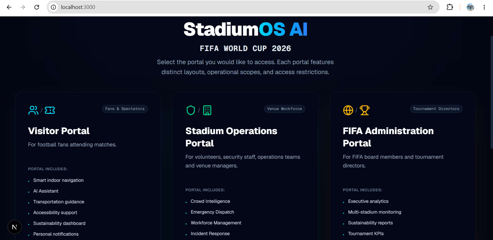
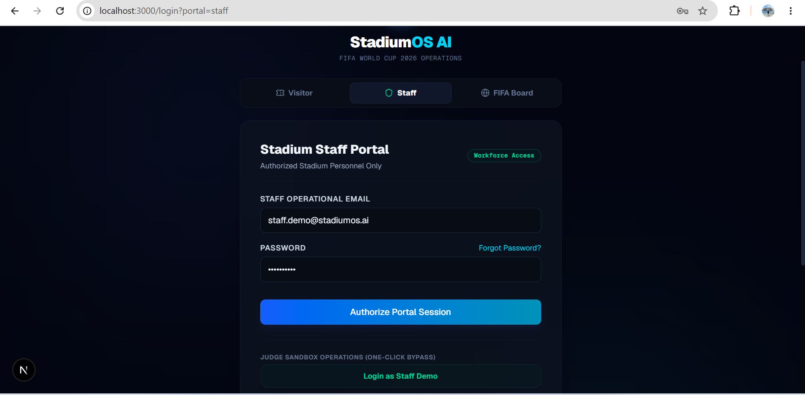
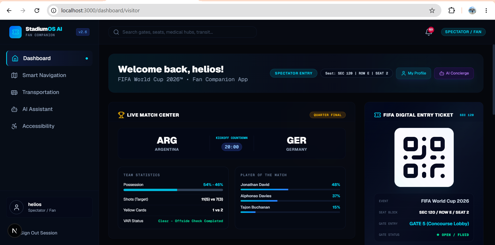
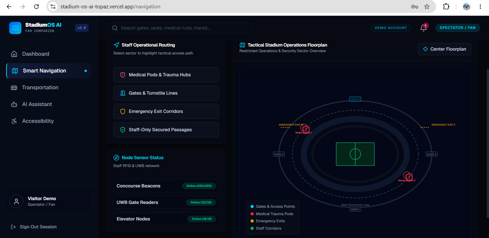
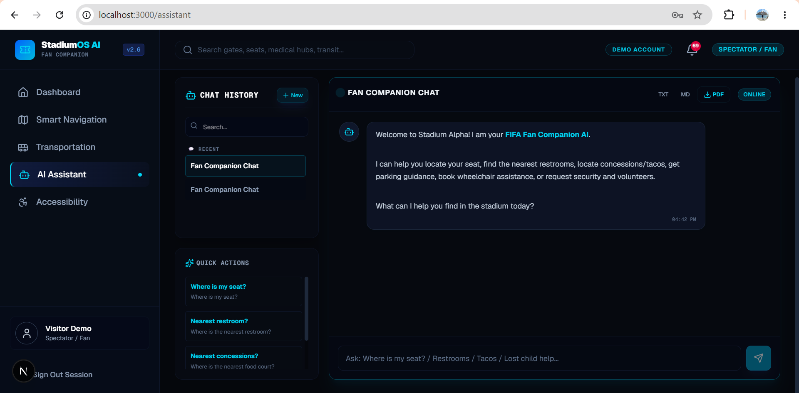
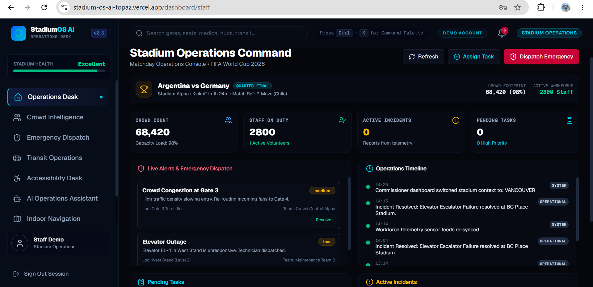
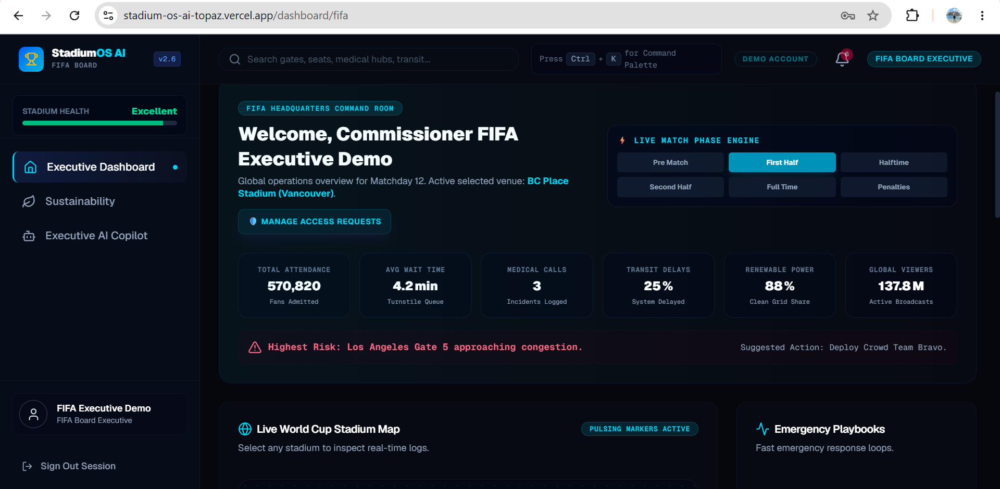
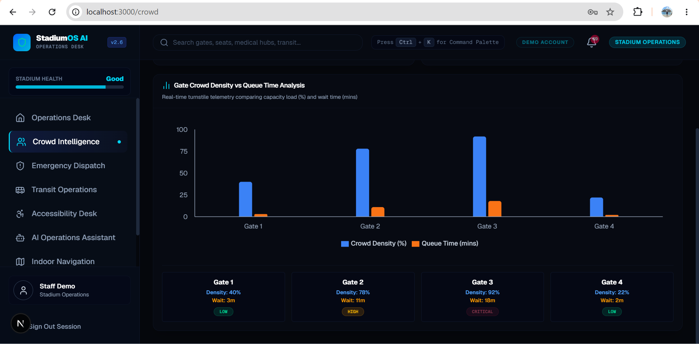

# 🏟️ StadiumOS AI — FIFA World Cup 2026 Smart Stadium Operating Platform

<p align="center">
  
</p>

<p align="center">
  <b>An AI-powered Smart Stadium Operations Platform built for FIFA World Cup 2026.</b><br>
  Enhancing fan experience, workforce coordination, venue operations, sustainability, and executive decision-making through Generative AI.
</p>

<p align="center">


</p>

---

# 🌍 Vision

Large sporting events like the **FIFA World Cup** involve millions of spectators, thousands of volunteers, security personnel, transportation teams, accessibility coordinators, and executive staff.

Most current stadium systems operate independently.

**StadiumOS AI** unifies every stakeholder into a single intelligent platform powered by **Google Gemini AI**, **Supabase**, and **Next.js**.

---

# 🎯 Challenge Alignment

Built for:

**PromptWars Challenge 4 — Smart Stadiums & Tournament Operations**

The platform uses **Generative AI** to improve:

- 🧭 Stadium Navigation
- 👥 Crowd Intelligence
- 🚑 Emergency Response
- 🚆 Transportation
- ♿ Accessibility
- 🌱 Sustainability
- 🌍 Multilingual Assistance
- 🤖 AI Decision Support
- 📊 Executive Operations

---

# 🏗️ System Architecture

```
                     ┌──────────────────────────────┐
                     │      StadiumOS AI Portal     │
                     │      Next.js + React 19      │
                     └─────────────┬────────────────┘
                                   │
              ┌────────────────────┼────────────────────┐
              │                    │                    │
              ▼                    ▼                    ▼
      Visitor Portal        Staff Portal        FIFA Executive
              │                    │                    │
              └──────────────┬─────┴────────────────────┘
                             ▼
                  Google Gemini AI Assistant
                             │
                             ▼
                 Supabase Authentication
                             │
                             ▼
                  PostgreSQL + User Profiles
```

---

# 📸 Application Screenshots

## 🏠 Landing Page


---

## 🔐 Login Portal



---

## 🎟️ Visitor Dashboard



---

## 🗺️ Smart Stadium Navigation



---

## 🤖 AI Stadium Assistant



---

## 👷 Staff Operations Dashboard



---

## 🏆 FIFA Executive Dashboard



---

## 📊 Crowd Intelligence & Analytics



---

# 👥 User Portals

## 🎟️ Visitor Portal

Features include:

- AI Stadium Assistant
- Digital Match Tickets
- QR Entry Pass
- Merchandise Reservation
- Food Pre-order
- Accessibility Requests
- Smart Navigation
- Transportation Guidance
- Notifications
- Profile Management

---

## 👷 Staff Operations Portal

Designed for stadium workforce.

Includes:

- Match Operations Console
- Crowd Monitoring
- Emergency Dispatch
- Transport Operations
- Accessibility Desk
- AI Operations Assistant
- Indoor Navigation
- Incident Management

---

## 🏆 FIFA Executive Portal

Tournament-wide command center.

Provides:

- Multi-Stadium Monitoring
- Sustainability Analytics
- Carbon Footprint Dashboard
- Executive AI Assistant
- Global Incident Reports
- Venue Comparison
- Tournament KPIs

---

# 🤖 AI Capabilities

Powered by **Google Gemini**.

Supports:

- Natural Language Queries
- Stadium Operations Guidance
- Crowd Flow Analysis
- Emergency Recommendations
- Executive Insights
- Accessibility Assistance
- Fan Support
- Route Suggestions

---

# 🔒 Authentication

Supports two modes:

### Production Mode

- Supabase Authentication
- Email Verification
- Secure Sessions
- User Data Isolation
- Role-based Routing

### Demo Mode

Instant access for:

- Visitor
- Staff
- FIFA Executive

without requiring authentication.

---

# 🛠️ Tech Stack

### Frontend

- Next.js 15
- React 19
- TypeScript
- Tailwind CSS
- Framer Motion
- Lucide Icons

### Backend

- Supabase
- PostgreSQL
- Authentication
- Row Level Security

### AI

- Google Gemini API

### Charts

- Recharts

### Deployment

- Vercel

---

# ✨ Key Features

## 🧭 Smart Navigation

- Indoor routing
- Medical locations
- Emergency exits
- Gate guidance

---

## 🚦 Crowd Intelligence

- Queue monitoring
- Density prediction
- AI alerts

---

## 🚑 Emergency Operations

- Incident tracking
- Dispatch teams
- Medical routing

---

## 🚆 Transportation

- Metro updates
- Shuttle monitoring
- Parking guidance

---

## ♿ Accessibility

- Wheelchair requests
- Sensory kits
- Volunteer escort
- Audio assistance

---

## 🌱 Sustainability

- Carbon monitoring
- Recycling metrics
- Energy analytics

---

## 🤖 AI Copilot

Role-specific assistants for:

- Visitors
- Staff
- FIFA Executives

---

# 🔐 Security

- Secure Authentication
- Protected Routes
- Role-based Authorization
- User Data Isolation
- Email Verification
- Session Validation

---

# 🚀 Installation

Clone the repository

```bash
git clone https://github.com/SVG700/StadiumOS-AI.git
```

Navigate into the project

```bash
cd StadiumOS-AI
```

Install dependencies

```bash
npm install
```

Create environment variables

```bash
cp .env.example .env.local
```

Run locally

```bash
npm run dev
```

---

# 🧪 Validation

The project successfully passes:

```bash
npm run lint
```

✅ ESLint

```bash
npx tsc --noEmit
```

✅ TypeScript

```bash
npm run build
```

✅ Production Build

---

# 🌐 Live Demo

**Application**

https://stadium-os-ai-topaz.vercel.app/

---

# 📂 Repository

https://github.com/SVG700/StadiumOS-AI

---

# 👨‍💻 Developer

**Samhith V Gupta**

B.Tech Computer Science Engineering

Presidency University, Bengaluru

GitHub:
https://github.com/SVG700

LinkedIn:
https://www.linkedin.com/in/samhith-v-gupta-302740392

---

# ⭐ If you like this project

Give this repository a ⭐ on GitHub!
